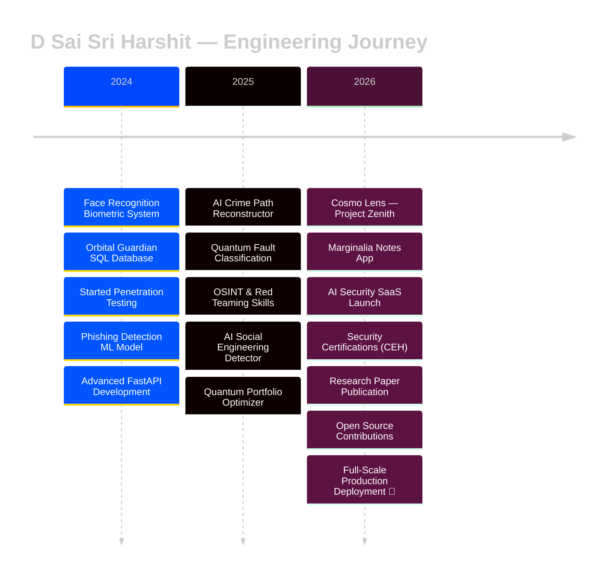
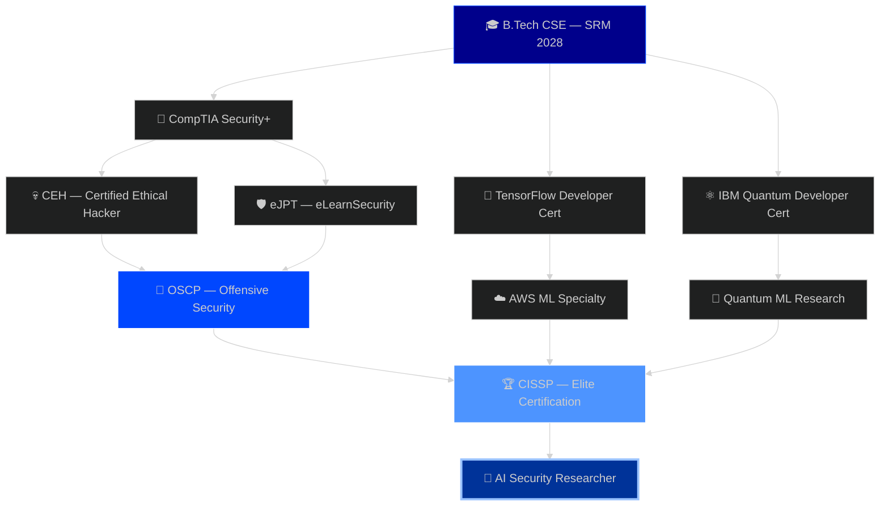

<!-- ========================================================= -->
<!--               CYBERPUNK HERO HEADER — BLUE/DARK          -->
<!-- ========================================================= -->

<div align="center">


</div>

<!-- ========================================================= -->
<!--                     TYPING ANIMATION                      -->
<!-- ========================================================= -->

<div align="center">

<a href="https://github.com/dsaisrih">

</a>

</div>

<br>

<!-- ========================================================= -->
<!--                          BADGES                           -->
<!-- ========================================================= -->

<div align="center">


</div>

---

# 〔 👨‍💻 ENGINEER PROFILE 〕

```yaml
╔══════════════════════════════════════════════════════════════╗
║                ◈ CLASSIFIED ENGINEER CARD ◈                 ║
╠══════════════════════════════════════════════════════════════╣
║                                                              ║
║  Name         : D Sai Sri Harshit                           ║
║  Username     : @dsaisrih                                   ║
║  Role         : Cyber Security Engineer                     ║
║                 AI Developer | Quantum Explorer             ║
║                                                              ║
║  University   : SRM Institute of Science & Technology       ║
║  Degree       : B.Tech CSE (Cyber Security)                 ║
║  Graduation   : 2028                                        ║
║  Location     : India 🇮🇳                                   ║
║                                                              ║
╠══════════════════════════════════════════════════════════════╣
║                                                              ║
║  SPECIALIZATIONS                                             ║
║                                                              ║
║   ► AI Security Systems                                     ║
║   ► Penetration Testing & Ethical Hacking                   ║
║   ► Quantum Computing Applications                          ║
║   ► GIS + Crime Intelligence Systems                        ║
║   ► Computer Vision & Real-Time AI                          ║
║   ► Secure API & Backend Architecture                       ║
║   ► Threat Intelligence & OSINT                             ║
║                                                              ║
╠══════════════════════════════════════════════════════════════╣
║                                                              ║
║  CURRENTLY                                                   ║
║                                                              ║
║   🔭 Working On  → AI Crime Path Reconstructor              ║
║   ⚛  Exploring  → Quantum Portfolio Optimization            ║
║   🌱 Learning   → Advanced Red Teaming & LLM Security       ║
║   🛰  Researching→ AI + GIS + Cyber Intelligence            ║
║   💡 Building   → AI Security SaaS Systems                  ║
║   🤝 Open To    → Research & Open Source Collaborations     ║
║                                                              ║
╚══════════════════════════════════════════════════════════════╝
```


# 〔 🧠 CORE ENGINEERING DOMAINS 〕

<div align="center">

| DOMAIN | FOCUS |
|:---|:---|
| 🔐 Cyber Security | Pentesting, Threat Intelligence, Recon, OSINT |
| 🤖 Artificial Intelligence | ML, Computer Vision, AI Security |
| 🌐 Full Stack Development | React, FastAPI, REST APIs |
| ⚛ Quantum Computing | Qiskit, QML, QAOA Optimization |
| 🛰 GIS Intelligence | Crime Route Reconstruction & Mapping |
| ☁ Cloud Engineering | Firebase, Docker, Vercel, Render |
| 📊 Data Engineering | SQL, Analytics, Pipelines |

</div>

---


# 〔 🧠 NEURAL CORE — EXPERTISE MAP 〕

<table>
<tr>
<td width="50%">

### 🔐 CYBER SECURITY
```
Penetration Testing      ████████████ 90%
Network Security         ███████████░ 85%
Web App Security         ██████████░░ 80%
Vulnerability Assessment █████████░░░ 75%
Threat Modeling          █████████░░░ 75%
Malware Analysis         ████████░░░░ 70%
Secure Coding            ██████████░░ 80%
OSINT & Recon            ████████████ 90%
```

</td>
<td width="50%">

### 🤖 ARTIFICIAL INTELLIGENCE
```
Computer Vision          ████████████ 92%
Machine Learning         ██████████░░ 80%
Deep Learning            █████████░░░ 75%
NLP / LLMs               ███████░░░░░ 65%
AI Security Systems      ██████████░░ 82%
Data Analysis            █████████░░░ 78%
Real-Time AI Systems     ███████████░ 88%
Quantum ML               ████████░░░░ 70%
```

</td>
</tr>
<tr>
<td width="50%">

### ⚙️ BACKEND & SYSTEMS
```
Python                   ████████████ 95%
FastAPI / Flask          ██████████░░ 82%
REST API Design          ██████████░░ 80%
Database Design (SQL)    █████████░░░ 77%
Linux / Bash             ██████████░░ 83%
Docker & Containers      ███████░░░░░ 65%
Microservices            ████████░░░░ 70%
System Architecture      █████████░░░ 75%
```

</td>
<td width="50%">

### ⚛ QUANTUM & FRONTEND
```
Qiskit / QML             ████████░░░░ 70%
QAOA Optimization        ███████░░░░░ 65%
React / JS               ███████░░░░░ 65%
HTML / CSS               ████████████ 88%
OpenCV / MediaPipe       ████████████ 92%
Git & Version Control    ██████████░░ 85%
C / C++                  ████████░░░░ 70%
TypeScript               █████░░░░░░░ 55%
```

</td>
</tr>
</table>

---

# 〔 ⚡ TECHNICAL ARSENAL 〕

### 💻 Languages

<p align="left">

</p>

### ⚙️ Frameworks, Backend & Cloud

<p align="left">


</p>

### 🤖 AI / ML / Quantum

<p align="left">


</p>

### 🔐 Security Arsenal

<p align="left">


</p>

### 🗄 Databases

<p align="left">

</p>

### ☁ DevOps & Infrastructure

<p align="left">

</p>

---


# 〔 🚀 FEATURED PROJECTS — MISSION DOSSIER 〕

<div align="center">

| 🔢 | PROJECT | TECH STACK | DOMAIN | STATUS | IMPACT |
|:---:|:---|:---|:---|:---:|:---|
| 01 | **🛰 AI Crime Path Reconstructor** | React, FastAPI, OSRM, GIS | AI + Cyber Security | 🚧 Active | Real-time crime route mapping & prediction engine |
| 02 | **🌌 Cosmo Lens — Project Zenith** | TypeScript, React, WebGL | Space / Web | ✅ Live | Immersive astral web visualization experience |
| 03 | **📝 Marginalia** | JavaScript, Firebase, Firestore | Productivity | ✅ Live | Firebase-backed note-taking app with cross-device sync |
| 04 | **🚀 Major Project — Loading Soon** | TBA | Undisclosed | 🔒 Coming Soon | Details under wraps — reveal coming soon |
| 05 | **⚛ Quantum Multi-Fault Classification** | Qiskit, React, AerSimulator | Quantum AI | ✅ Live | Noise-resilient quantum circuit fault detection |
| 06 | **📈 Quantum Portfolio Optimizer** | Qiskit, FastAPI, React | Quantum Finance | 🧪 Research | QAOA-powered financial portfolio optimization |
| 07 | **🔐 AI Social Engineering Detector** | NLP, FastAPI, React | Cyber Security | 🚧 Dev | AI-powered phishing & manipulation detection |
| 08 | **🛡 Phishing URL Detector v2** | ML, FastAPI, Scikit-learn | Cyber Security | 🔄 v2.0 | 92% accuracy malicious URL classifier API |
| 09 | **👁 Face Recognition System** | Python, OpenCV, dlib | AI Security | ✅ Complete | Real-time biometric auth with liveness detection |
| 10 | **🖱 Virtual Mouse Controller** | Python, MediaPipe, cv2 | HCI / AI | ✅ Complete | Touchless gesture-controlled cursor system |
| 11 | **🌌 Orbital Guardian Database** | PostgreSQL, SQL | Space Tech | ✅ Complete | Full mission database for space operations |
| 12 | **🔍 OSINT Recon Framework** | Python, APIs | Cyber Security | 🧪 Dev | Automated open-source intelligence aggregator |
| 13 | **🤖 AI Network Anomaly Monitor** | Python, ML, Sockets | Network Security | 🧪 Dev | Real-time ML-based traffic anomaly detection |

</div>

---

# 〔 📊 PROJECT STATUS DASHBOARD 〕

```
╔══════════════════════════════════════════════════════════════════╗
║                   LIVE DEVELOPMENT STATUS v3.0                  ║
╠══════════════════════════════════════════════════════════════════╣
║                                                                  ║
║  🛰 AI CRIME PATH RECONSTRUCTOR                                  ║
║  ├─ Frontend UI         ████████████████████  100% ✅           ║
║  ├─ GIS Integration     ███████████████░░░░░   75% 🔄           ║
║  ├─ Evidence Mapping    █████████████░░░░░░░   70% 🔄           ║
║  ├─ AI Prediction       ████████████░░░░░░░░   60% 🚧           ║
║  └─ API Deployment      ███████░░░░░░░░░░░░░   40% 🚧           ║
║                                                                  ║
║  🌌 COSMO LENS — PROJECT ZENITH                                  ║
║  ├─ WebGL Visualization ██████████████████░░   90% ✅           ║
║  ├─ Frontend UI         ███████████████████░   95% ✅           ║
║  └─ Deployment          ████████████████████  100% ✅           ║
║                                                                  ║
║  📝 MARGINALIA                                                   ║
║  ├─ Core Editor         ████████████████████  100% ✅           ║
║  ├─ Firebase Sync       █████████████████░░░   85% 🔄           ║
║  └─ Deployment          ████████████████████  100% ✅           ║
║                                                                  ║
║  🚀 MAJOR PROJECT — LOADING SOON                                 ║
║  └─ Status              ░░░░░░░░░░░░░░░░░░░░    ?? 🔒           ║
║                                                                  ║
║  ⚛ QUANTUM MULTI-FAULT CLASSIFICATION                            ║
║  ├─ Quantum Circuit     ████████████████████  100% ✅           ║
║  ├─ Fidelity Analysis   ██████████████████░░   90% ✅           ║
║  ├─ Frontend UI         █████████████████░░░   85% 🔄           ║
║  └─ Noise Simulation    ██████████████░░░░░░   70% 🔄           ║
║                                                                  ║
║  📈 QUANTUM PORTFOLIO OPTIMIZER                                  ║
║  ├─ QAOA Circuit        █████████████████░░░   85% 🔄           ║
║  ├─ FastAPI Backend     ██████████████░░░░░░   70% 🔄           ║
║  ├─ React Dashboard     ████████████░░░░░░░░   60% 🚧           ║
║  └─ Backtesting Engine  █████████░░░░░░░░░░░   45% 🚧           ║
║                                                                  ║
║  🔐 AI SOCIAL ENGINEERING DETECTOR                               ║
║  ├─ NLP Model Training  ██████████████░░░░░░   70% 🔄           ║
║  ├─ FastAPI Backend     ████████████░░░░░░░░   60% 🔄           ║
║  ├─ React Frontend      ██████████░░░░░░░░░░   50% 🚧           ║
║  └─ Dataset Collection  ████████████████░░░░   80% 🔄           ║
║                                                                  ║
║  🛡 PHISHING DETECTOR v2.0                                       ║
║  ├─ Dataset Collection  ████████████████████  100% ✅           ║
║  ├─ Model Training      ████████████████████   92% ✅           ║
║  ├─ FastAPI Backend     ██████████████████░░   90% 🔄           ║
║  ├─ Model Accuracy      ████████████████░░░░   80% 🔄           ║
║  └─ Web Dashboard       ██████████░░░░░░░░░░   50% 🚧           ║
║                                                                  ║
║  🔍 OSINT RECON FRAMEWORK                                        ║
║  ├─ Core Engine         ██████████████░░░░░░   65% 🔄           ║
║  ├─ API Integrations    ██████████░░░░░░░░░░   50% 🚧           ║
║  └─ Report Generator    ████████░░░░░░░░░░░░   35% 🚧           ║
║                                                                  ║
║  🤖 AI NETWORK ANOMALY MONITOR                                   ║
║  ├─ Traffic Capture     █████████████░░░░░░░   65% 🔄           ║
║  ├─ ML Anomaly Model    ████████████░░░░░░░░   55% 🚧           ║
║  └─ Alert Dashboard     ███████░░░░░░░░░░░░░   35% 🚧           ║
║                                                                  ║
╚══════════════════════════════════════════════════════════════════╝
```

---


# 〔 🧩 ENGINEERING TIMELINE 〕



---

# 〔 🗺 2026 MISSION ROADMAP 〕

```
Q1 2026  ████████████████░░░░░░░░  75% COMPLETE
  ✅ AI Crime Path Reconstructor — Frontend Done
  ✅ Quantum Fault Classifier — Live
  🔄 Phishing Detector v2.0 API Improving
  🔄 GitHub Profile Revamp

Q2 2026  ████████████░░░░░░░░░░░░  50% IN PROGRESS
  ✅ Cosmo Lens — Project Zenith Deployed
  ✅ Marginalia Notes App Deployed
  🚧 Launch AI Security SaaS MVP
  🚧 Achieve CEH Certification
  🚧 AI Social Engineering Detector — Beta
  🚧 Deploy Quantum Portfolio Optimizer

Q3 2026  ░░░░░░░░░░░░░░░░░░░░░░░░  PLANNED
  🔒 Reveal Major Project — Loading Soon
  📋 Submit Research Paper — AI Threat Intelligence
  📋 Open Source Contributions — Top AI Security Repos
  📋 OSINT Framework Public Release
  📋 Start OSCP Prep

Q4 2026  ░░░░░░░░░░░░░░░░░░░░░░░░  PLANNED
  📋 Full-Time Role: Cyber Security / AI Engineer
  📋 OSCP Certification Attempt
  📋 Release Open Source Security Tools Suite
  📋 Community Speaker / Blog Author
```

---

# 〔 🎯 CERTIFICATION ROADMAP 〕



---


# 〔 🔬 RESEARCH INTERESTS 〕

### 🧬 Primary Research Areas

| 🔍 Topic | 📌 Focus |
|:---|:---|
| 🤖 AI-Driven Threat Intelligence | Using ML to predict and classify cyber threats in real-time |
| 🧠 LLM Security | Prompt injection, jailbreaking & adversarial attacks on language models |
| ⚛ Quantum Optimization | QAOA-based computation for complex security problems |
| 🛰 GIS Intelligence | Crime route reconstruction & predictive mapping |
| 🔏 Federated Learning for Privacy | Privacy-preserving security models without centralised data |
| 👁 Adversarial Vision Attacks | Fooling computer vision security systems with adversarial inputs |

### 🧪 Secondary Interests

| 🔍 Topic | 📌 Focus |
|:---|:---|
| 🧬 Behavioral Biometrics | Continuous user authentication via behavioral patterns |
| 🕸 GNN for Intrusion Detection | Graph Neural Networks to detect network anomalies |
| 🧩 Explainable AI in Security | Making AI security decisions transparent and auditable |
| ⚡ Side-Channel Analysis | Hardware-level attack and defence research |
| 🔐 AI Social Engineering | Detecting manipulation & phishing via NLP models |

> 🎯 **Publications Target:** IEEE / ACM Conference on AI Security — 2026
>
> *"At the intersection of Artificial Intelligence, Quantum Computing and Cyber Security, I build systems that don't just defend — they predict, adapt, and evolve against future threats."*

---


# 〔 🏆 ACHIEVEMENTS & TARGETS 〕

```yaml
Achievements:
  ► TCS CodeVita Participant
  ► Quantum Computing Research Developer
  ► AI + Cyber Security Systems Builder
  ► Full Stack Security Platform Developer
  ► Computer Vision & GIS Intelligence Engineer

2026 Targets:
  ► Publish AI Security Research Paper (IEEE / ACM)
  ► Build Production-Level AI Security SaaS
  ► CEH Certification
  ► Open Source Contributions to Top Security Repos
  ► Participate in National Hackathons
  ► Advanced Threat Intelligence Platform Launch
```

---    

# 〔 📊 GITHUB INTELLIGENCE DASHBOARD 〕
<div align="center">


</div>

<br>

<div align="center">


</div>

<br>

<div align="center">


</div>

<br>


### 🐍 Contribution Grid Snake

<div align="center">

</div>

---

# 〔 💻 BATTLE STATION — DEV SETUP 〕

<div align="center">

| Component | Spec | Purpose |
|:---:|:---|:---|
| 💻 **Machine** | HP Victus Gaming Laptop | Primary Dev & Testing Rig |
| 🧠 **CPU** | AMD Ryzen 9 | Heavy ML & Quantum Simulation |
| 🎮 **GPU** | NVIDIA RTX 4060 8GB VRAM | Deep Learning, CV Model Training |
| 🧊 **RAM** | 16GB DDR5 | Multi-VM Pentesting Labs |
| 💾 **Storage** | 1TB NVMe SSD | Fast Boot, Rapid I/O |
| 🖥 **OS** | Windows 11 + Kali Linux (VMWare) | Dev + Security Research |
| 🔧 **IDE** | VS Code + PyCharm + Neovim | Multi-Language Development |
| 🌐 **Deploy** | Firebase + Vercel + Render | Cloud Production Hosting |
| 🌐 **Browser** | Brave + Burp Suite Proxy | Secure Browsing + Web Pentesting |
| 🔑 **VPN** | ProtonVPN | OpSec & Secure Tunneling |
| 📡 **Virtualization** | VirtualBox + VMWare + Docker | Isolated Lab Environments |

</div>

---


# 〔 🌐 SECURITY PHILOSOPHY 〕

```
╔═══════════════════════════════════════════════════════════════╗
║                                                               ║
║   "The best defense is understanding the offense."           ║
║                                                               ║
║   Security is not a product — it is a process.              ║
║   Intelligence is not data — it is pattern recognition.      ║
║   AI is not magic — it is mathematics at scale.              ║
║   Quantum is not hype — it is the next frontier.             ║
║                                                               ║
║   I build at the intersection of all four.                   ║
║                                              — @dsaisrih      ║
╚═══════════════════════════════════════════════════════════════╝
```

---

# 〔 🤝 OPEN SOURCE & COMMUNITY 〕

```
Areas of Contribution:
  ► AI Security Tools & Libraries
  ► Python Automation Utilities
  ► Quantum Computing Experiments
  ► Cyber Security Learning Resources
  ► Computer Vision Projects

Currently Looking to Contribute to:
  🔵 Sigma Rules — Detection Engineering
  🔵 TheHive / MISP — Threat Intelligence
  🔵 OpenCV Community Projects
  🔵 OWASP Testing Guide
  🔵 Qiskit Community & IBM Quantum Network
```

---

# 〔 📡 CONNECT — ESTABLISH SECURE CHANNEL 〕

<div align="center">

<a href="https://github.com/dsaisrih">
  
</a>
&nbsp;
<a href="https://www.linkedin.com/in/dsaisrih">
  
</a>
&nbsp;
<a href="mailto:dsaisriharshit@gmail.com">
  
</a>
&nbsp;
<a href="https://x.com/dsaisrih">
  
</a>

</div>

<br>

<div align="center">

```
╔════════════════════════════════════════════════════════════════╗
║                                                                ║
║     SYSTEM STATUS  : ONLINE 🟢                                ║
║     SECURITY LEVEL : GUARDIAN MODE 🔐                          ║
║     AVAILABILITY   : OPEN TO OPPORTUNITIES 🚀                 ║
║     MISSION        : BUILD • BREAK • DEFEND • INNOVATE        ║
║                                                                ║
╚════════════════════════════════════════════════════════════════╝
```

</div>

<!-- FOOTER -->
<div align="center">

</div>
