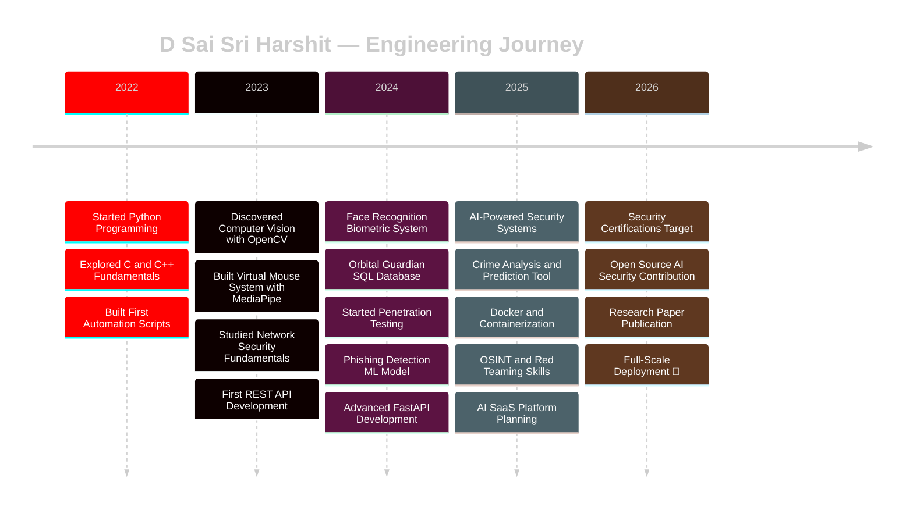
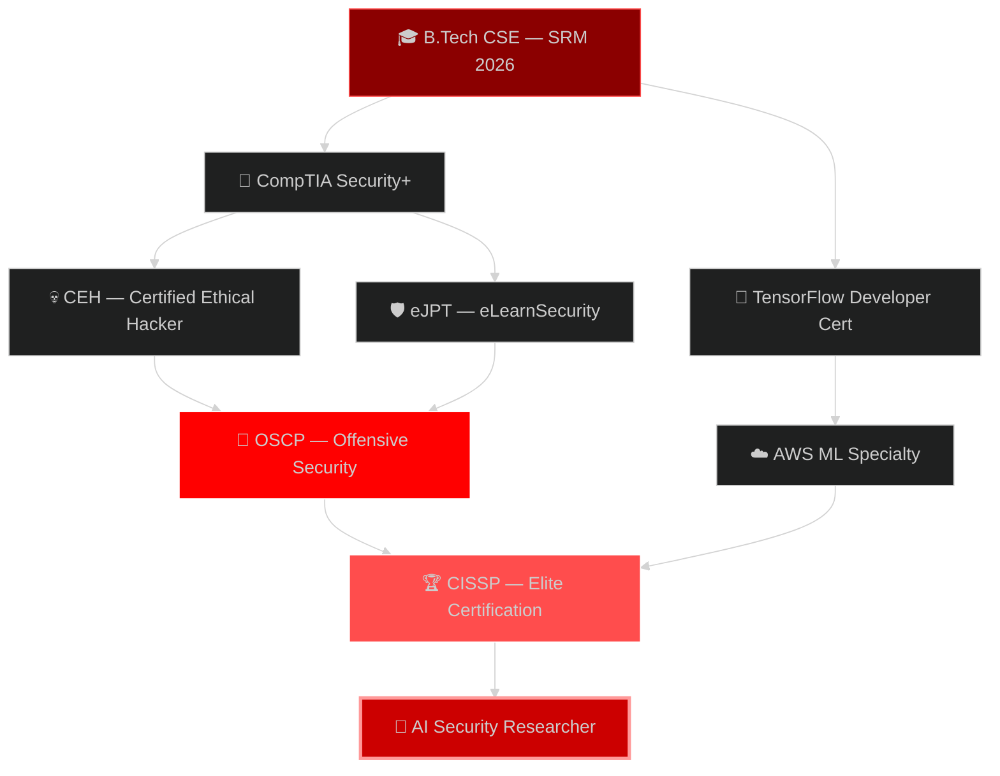

<!-- HEADER ANIMATION -->
<div align="center">

</div>

<!-- TYPING ANIMATION -->
<div align="center">
  
</div>

<!-- BADGES ROW -->
<div align="center">
  
  
  
  
</div>

<br>

---

<!-- SYSTEM BOOT SEQUENCE -->
# 〔 ⚡ SYSTEM INITIALIZATION 〕

```bash
███████████████████████████████████████████████████████████████
█                                                             █
█   ██████╗     ███████╗ █████╗ ██╗    ███████╗██████╗ ██╗  █
█   ██╔══██╗    ██╔════╝██╔══██╗██║    ██╔════╝██╔══██╗██║  █
█   ██║  ██║    ███████╗███████║██║    ███████╗██████╔╝██║  █
█   ██║  ██║    ╚════██║██╔══██║██║    ╚════██║██╔══██╗██║  █
█   ██████╔╝    ███████║██║  ██║██║    ███████║██║  ██║██║  █
█   ╚═════╝     ╚══════╝╚═╝  ╚═╝╚═╝   ╚══════╝╚═╝  ╚═╝╚═╝  █
█                                                             █
███████████████████████████████████████████████████████████████

[BOOT] >> Initializing D Sai Sri Harshit System...
[BOOT] >> Loading Kernel Modules...

[✔] CyberSecurity Engine ............. LOADED
[✔] AI/ML Neural Cores .............. LOADED
[✔] Computer Vision Module .......... LOADED
[✔] Backend Architecture ............ LOADED
[✔] Threat Detection System ......... ARMED
[✔] Firewall ........................ ACTIVE
[✔] Encryption Layer ................ AES-256

[SYSTEM] >> All systems nominal.
[SYSTEM] >> STATUS: FULLY OPERATIONAL 🚀
[SYSTEM] >> THREAT LEVEL: GUARDIAN MODE 🛡
```

---

<!-- ABOUT ME TERMINAL -->
# 〔 👨‍💻 IDENTITY CARD 〕

```yaml
╔══════════════════════════════════════════════════════════════╗
║              ◈ ENGINEER PROFILE — CLASSIFIED ◈              ║
╠══════════════════════════════════════════════════════════════╣
║                                                              ║
║  Name         :  D Sai Sri Harshit                          ║
║  Alias        :  @dsaisrih                                   ║
║  Role         :  Cyber Security Engineer | AI Developer      ║
║  University   :  SRM Institute of Science & Technology       ║
║  Location     :  India 🇮🇳                                   ║
║  Year         :  2026 Graduate — B.Tech CSE                  ║
║                                                              ║
╠══════════════════════════════════════════════════════════════╣
║                                                              ║
║  SPECIALIZATIONS:                                            ║
║    ► Penetration Testing & Ethical Hacking                   ║
║    ► AI-Powered Security Systems                             ║
║    ► Real-Time Computer Vision                               ║
║    ► Secure API & Backend Architecture                       ║
║    ► Threat Intelligence & Crime Analytics                   ║
║                                                              ║
╠══════════════════════════════════════════════════════════════╣
║                                                              ║
║  MISSION:                                                    ║
║    Build secure, scalable & intelligent systems that         ║
║    merge offensive security with AI-driven defense.          ║
║                                                              ║
║  CURRENTLY:                                                  ║
║    🔭 Working on  →  AI Crime Analysis Platform              ║
║    🌱 Learning    →  Advanced Red Teaming & LLM Security     ║
║    🤝 Open to     →  Internships & Research Collabs          ║
║    💡 Building    →  AI Security SaaS                        ║
║                                                              ║
╚══════════════════════════════════════════════════════════════╝
```

---


# 〔 🧠 NEURAL CORE — EXPERTISE MAP 〕

<table>
<tr>
<td width="50%">

### 🔐 CYBER SECURITY
```
Penetration Testing      ████████████ 90%
Network Security         ███████████░ 85%
Web App Security         ██████████░░ 80%
Vulnerability Assessment █████████░░░ 75%
Threat Modeling          █████████░░░ 75%
Malware Analysis         ████████░░░░ 70%
Secure Coding            ██████████░░ 80%
OSINT & Recon            ████████████ 90%
```

</td>
<td width="50%">

### 🤖 ARTIFICIAL INTELLIGENCE
```
Computer Vision          ████████████ 92%
Machine Learning         ██████████░░ 80%
Deep Learning            █████████░░░ 75%
NLP / LLMs               ███████░░░░░ 65%
AI Security Systems      ██████████░░ 82%
Data Analysis            █████████░░░ 78%
Real-Time AI Systems     ███████████░ 88%
Predictive Analytics     ████████░░░░ 70%
```

</td>
</tr>
<tr>
<td width="50%">

### ⚙️ BACKEND & SYSTEMS
```
Python                   ████████████ 95%
FastAPI / Flask          ██████████░░ 82%
REST API Design          ██████████░░ 80%
Database Design (SQL)    █████████░░░ 77%
Linux / Bash             ██████████░░ 83%
Docker & Containers      ███████░░░░░ 65%
Microservices            ████████░░░░ 70%
System Architecture      █████████░░░ 75%
```

</td>
<td width="50%">

### 🌐 FRONTEND & OTHER
```
HTML / CSS               ████████████ 88%
JavaScript               ███████░░░░░ 65%
React Basics             ██████░░░░░░ 60%
OpenCV / MediaPipe       ████████████ 92%
Git & Version Control    ██████████░░ 85%
C / C++                  ████████░░░░ 70%
Java                     ███████░░░░░ 65%
TypeScript               █████░░░░░░░ 55%
```

</td>
</tr>
</table>

---


# 〔 🧩 PROJECT EVOLUTION — TECH TIMELINE 〕



---

# 〔 🚀 FEATURED PROJECTS — MISSION DOSSIER 〕

<div align="center">

| 🔢 | PROJECT | TECH STACK | DOMAIN | STATUS | IMPACT |
|:---:|:---|:---|:---|:---:|:---|
| 01 | **👁 Face Recognition System** | Python, OpenCV, dlib | AI Security | ✅ Live | Real-time biometric auth with liveness detection |
| 02 | **🖱 Virtual Mouse** | Python, MediaPipe, cv2 | HCI / AI | ✅ Live | Touchless gesture-controlled cursor system |
| 03 | **🛡 Phishing URL Detector** | ML, FastAPI, Scikit-learn | Cyber Security | 🔄 v2.0 | AI-based malicious link detection API |
| 04 | **🌌 Orbital Guardian** | PostgreSQL, SQL | Space Tech / DB | ✅ Live | Full mission database for space operations |
| 05 | **🕵 Crime Analysis Tool** | Python, AI, Maps API | Public Safety | 🚧 Active | Predictive crime mapping and pattern analysis |
| 06 | **🔍 OSINT Recon Tool** | Python, APIs | Cyber Security | 🧪 Dev | Automated open-source intelligence framework |
| 07 | **🤖 AI Network Monitor** | Python, ML, Sockets | Network Security | 🧪 Dev | Real-time anomaly detection in network traffic |

</div>

### 📈 Live Project Progress Dashboard

```
╔════════════════════════════════════════════════════════════════╗
║                  PROJECT STATUS TRACKER v2.0                  ║
╠════════════════════════════════════════════════════════════════╣
║                                                                ║
║  🕵 CRIME ANALYSIS TOOL                                        ║
║  ├─ UI Dashboard        ██████████████████████ 100% ✅         ║
║  ├─ Data Pipeline       ████████████████░░░░░░  75% 🔄         ║
║  ├─ Map Integration     ██████████████░░░░░░░░  70% 🔄         ║
║  ├─ AI Prediction       ████████████░░░░░░░░░░  60% 🚧         ║
║  └─ API Deployment      ████████░░░░░░░░░░░░░░  40% 🚧         ║
║                                                                ║
║  🛡 PHISHING DETECTOR v2.0                                     ║
║  ├─ Dataset Collection  ██████████████████████ 100% ✅         ║
║  ├─ Model Training      ████████████████████░░  92% ✅         ║
║  ├─ FastAPI Backend     ██████████████████░░░░  90% 🔄         ║
║  ├─ Model Accuracy      ████████████████░░░░░░  80% 🔄         ║
║  └─ Web Dashboard       ██████████░░░░░░░░░░░░  50% 🚧         ║
║                                                                ║
║  🔍 OSINT RECON TOOL                                           ║
║  ├─ Core Engine         ██████████████░░░░░░░░  65% 🔄         ║
║  ├─ API Integrations    ██████████░░░░░░░░░░░░  50% 🚧         ║
║  └─ Report Generator    ████████░░░░░░░░░░░░░░  35% 🚧         ║
║                                                                ║
╚════════════════════════════════════════════════════════════════╝
```

---


# 〔 💻 TECHNICAL ARSENAL 〕

### 🐍 Languages

<p align="left">

</p>

### 🤖 AI / ML / Vision

<p align="left">


</p>

### 🛡 Security Tools & Frameworks

<p align="left">


</p>

### ⚙️ Frameworks & Backend

<p align="left">

</p>

### 🗄️ Databases

<p align="left">

</p>

### ☁️ Infrastructure, DevOps & Tools

<p align="left">

</p>

---


# 〔 🎯 CERTIFICATION TARGETS & LEARNING PATH 〕



---

# 〔 🗺 2026 MISSION ROADMAP 〕

```
Q1 2026  ████████████████░░░░░░░░  75% COMPLETE
  ✅ Complete Crime Analysis Tool Core
  ✅ Phishing Detector v2.0 API Live
  🔄 OSINT Framework Beta Release
  🔄 GitHub Profile Revamp

Q2 2026  ████████░░░░░░░░░░░░░░░░  35% IN PROGRESS
  🚧 Launch AI Security SaaS MVP
  🚧 Achieve CEH Certification
  🚧 Deploy First Production API
  📋 Begin Research Paper Writing

Q3 2026  ░░░░░░░░░░░░░░░░░░░░░░░░  PLANNED
  📋 Submit Research Paper — AI Threat Intelligence
  📋 Open Source Contributions — Top AI Security repos
  📋 Start OSCP Prep
  📋 Secure Internship or Job Offer

Q4 2026  ░░░░░░░░░░░░░░░░░░░░░░░░  PLANNED
  📋 Full-Time Role: Cyber Security / AI Engineer
  📋 OSCP Certification Attempt
  📋 Release Open Source Security Tools Suite
  📋 Community Speaker / Blog Author
```

---


# 〔 📊 GITHUB INTELLIGENCE DASHBOARD 〕

<div align="center">


</div>

<div align="center">

</div>

<div align="center">

</div>

### 🏆 GitHub Trophies

<div align="center">

</div>

### 🐍 Contribution Grid Snake

<div align="center">

</div>

---


# 〔 🔬 CURRENT RESEARCH INTERESTS 〕

```python
class ResearchFocus:
    def __init__(self):
        self.primary_interests = [
            "AI-Driven Threat Intelligence",
            "Large Language Model Security (Prompt Injection / Jailbreaking)",
            "Zero-Day Vulnerability Discovery using ML",
            "Federated Learning for Privacy-Preserving Security",
            "Adversarial Attacks on Computer Vision Systems",
        ]
        self.secondary_interests = [
            "Behavioral Biometrics for Continuous Authentication",
            "Graph Neural Networks for Network Intrusion Detection",
            "Explainable AI in Cybersecurity Decision Making",
            "Side-Channel Attack Analysis",
        ]
        self.publications_target = "2026 — IEEE / ACM Conference on AI Security"

    def mission_statement(self):
        return """
        At the intersection of Artificial Intelligence and Cyber Security,
        I aim to build systems that do not just defend — they predict,
        adapt, and evolve against future threats.
        """
```

---

# 〔 💻 BATTLE STATION — DEV SETUP 〕

<div align="center">

| Component | Spec | Purpose |
|:---:|:---|:---|
| 💻 **Machine** | HP Victus Gaming Laptop | Primary Dev & Testing Rig |
| 🧠 **CPU** | AMD Ryzen 9 | Heavy ML Training & Compilation |
| 🎮 **GPU** | NVIDIA RTX 4060 8GB VRAM | Deep Learning, CV Model Training |
| 🧊 **RAM** | 16GB DDR5 | Multi-VM Pentesting Labs |
| 💾 **Storage** | 512GB NVMe SSD | Fast Boot, Rapid I/O |
| 🖥 **OS** | Windows 11 + Kali Linux (Dual Boot) | Dev + Security Research |
| 🔧 **IDE** | VS Code + PyCharm + Neovim | Multi-Language Development |
| 🌐 **Browser** | Brave + Burp Suite Proxy | Secure Browsing + Web Pentesting |
| 🔑 **VPN** | ProtonVPN | OpSec & Secure Tunneling |
| 📡 **Virtualization** | VirtualBox + Docker | Isolated Lab Environments |

</div>

---


# 〔 🌐 SECURITY PHILOSOPHY 〕

```
╔═══════════════════════════════════════════════════════════════╗
║                                                               ║
║   "The best defense is understanding the offense."           ║
║                                                               ║
║   Security is not a product — it is a process.              ║
║   Intelligence is not data — it is pattern recognition.      ║
║   AI is not magic — it is mathematics at scale.              ║
║                                                               ║
║   I build at the intersection of all three.                  ║
║                                              — @dsaisrih      ║
╚═══════════════════════════════════════════════════════════════╝
```

---

# 〔 🤝 OPEN SOURCE & COMMUNITY 〕

```
Areas of Contribution:
  ► AI Security Tools & Libraries
  ► Python Automation Utilities
  ► Cyber Security Learning Resources
  ► Computer Vision Projects

Currently Looking to Contribute to:
  🔴 Sigma Rules — Detection Engineering
  🔴 TheHive / MISP — Threat Intelligence
  🔴 OpenCV Community Projects
  🔴 OWASP Testing Guide
```

---

# 〔 📡 CONNECT — ESTABLISH SECURE CHANNEL 〕

<div align="center">

[](https://github.com/dsaisrih)
[](https://linkedin.com)
[](mailto:dsaisriharshit@gmail.com)
[](https://twitter.com)
[](#)

</div>

<br>

<div align="center">

```
╔════════════════════════════════════════════════════════════════╗
║                                                                ║
║     SYSTEM STATUS  : ONLINE 🟢                                ║
║     SECURITY LEVEL : GUARDIAN MODE 🔐                          ║
║     AVAILABILITY   : OPEN TO OPPORTUNITIES 🚀                 ║
║     MISSION        : BUILD • BREAK • DEFEND • INNOVATE        ║
║                                                                ║
╚════════════════════════════════════════════════════════════════╝
```


</div>

<!-- FOOTER -->

