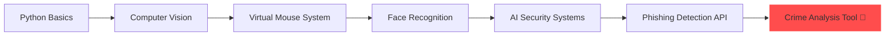

<p align="center">

</p>

<p align="center">

</p>

# ⚡ SYSTEM INITIALIZATION

```bash
> Booting Profile...
> Loading Modules...
> CyberSecurity ✔
> AI Systems ✔
> Backend ✔
> Status: READY 🚀
```

```yaml
👨‍💻 Engineering Profile
Name      : D Sai Sri Harshit
Role      : Cyber Security Engineer | AI Developer
University: SRM Institute of Science and Technology

Focus:
  - Secure Systems
  - Intelligent Automation
  - Real-Time AI Solutions

Mission:
  Build secure, scalable and intelligent
  systems that combine AI with
  real-world infrastructure.
```

---

# 🧠 Core Domains

### 🔐 Cyber Security

Network Security • Penetration Testing • Vulnerability Assessment • Threat Modeling • Web Security • Secure Coding

### 🤖 Artificial Intelligence

Machine Learning • Computer Vision • Real-Time AI Systems • AI Security Systems • Data Analysis

### ⚙️ System Design

Microservices Architecture • REST API Design • Distributed Systems • High Performance Systems

---

# 🧩 PROJECT EVOLUTION

*How my technical journey has evolved*



---

# 🚀 Featured Projects & Status

| Project | Tech Stack | Status | Description |
| :--- | :--- | :--- | :--- |
| **👁 Face Recognition** | Python, OpenCV | ✅ Completed | Real-time biometric authentication |
| **🖱 Virtual Mouse** | MediaPipe | ✅ Completed | Gesture-controlled cursor system |
| **🛡 Phishing Detector** | ML, FastAPI | 🔄 Improving | AI-based malicious URL detection |
| **🌌 Orbital Guardian** | SQL | ✅ Completed | Space mission database system |
| **🕵 Crime Analysis** | AI + Maps | 🚧 In Progress | Crime tracking & prediction system |

### 📈 Project Progress Tracker

**🕵 Crime Analysis Tool**  
UI Dashboard &nbsp;&nbsp;&nbsp;&nbsp;`██████████ 100%`  
Map Integration &nbsp;`███████░░░ 70%`  
AI Prediction &nbsp;&nbsp;&nbsp;`██████░░░░ 60%`

**🛡 Phishing Detector**  
Model Accuracy &nbsp;&nbsp;`████████░░ 80%`  
API Development `█████████░ 90%`

---

# 💻 Technical Arsenal

### 🛠 Programming & Frameworks

<p align="left">

</p>

### 🤖 AI / ML & Data

<p align="left">

</p>

### ☁️ Infrastructure & Security

<p align="left">

</p>

---

# 🎯 2026 ROADMAP

- [ ] Advanced Penetration Testing Certifications
- [ ] Deploy AI Security SaaS Platform
- [ ] Complete Full-Scale Crime Analysis Tool
- [ ] Contribute to major Open Source AI Security projects
- [ ] Research Publication in AI-driven Threat Intelligence

---

# 📊 GitHub Analytics

<p align="center">

<br>

</p>

### 🐍 Contribution Snake

<p align="center">

</p>

---

# 💻 Development System

<p align="left">


</p>

---

# 🌐 Connect With Me

<p align="center">
<a href="https://github.com/dsaisrih">

</a>
<a href="https://linkedin.com">

</a>
<a href="mailto:dsaisriharshit@gmail.com">

</a>
</p>

<p align="center">
<code>SYSTEM STATUS: ONLINE</code> • <code>SECURITY: ACTIVE 🔐</code> • <code>MISSION: BUILD • LEARN • SECURE</code>
</p>

<p align="center">

</p>
